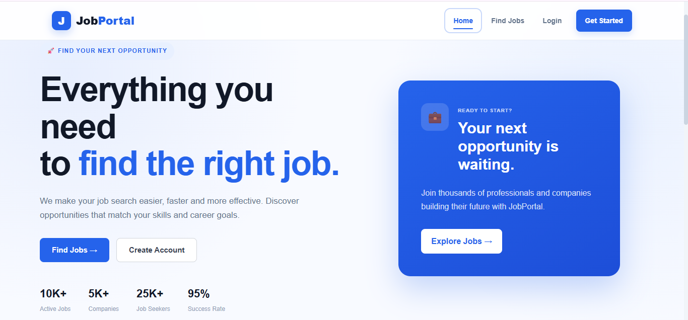
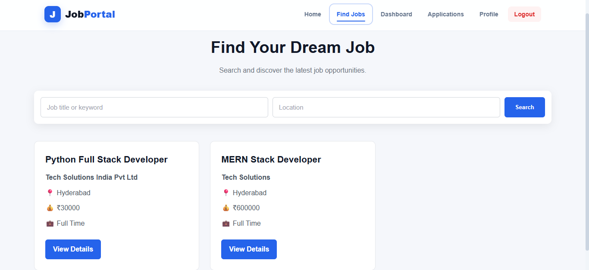
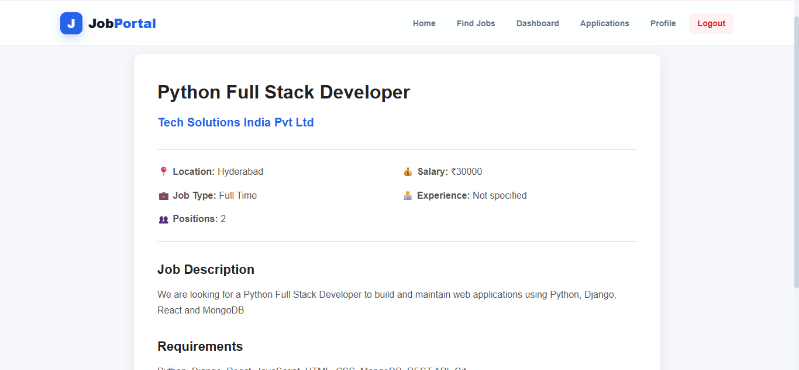
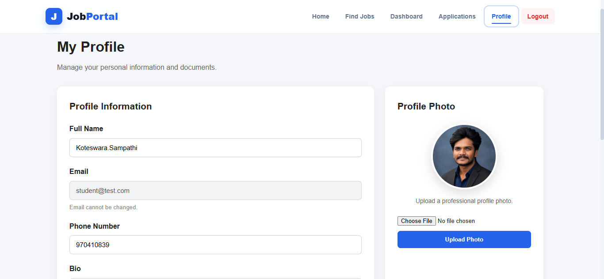
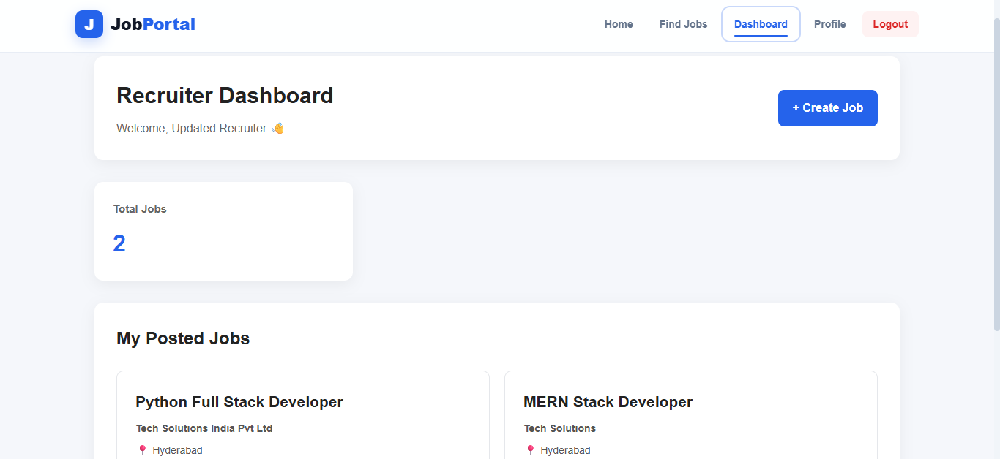

# 💼 MERN Job Portal

A full-stack **Job Portal web application** built using the **MERN stack — MongoDB, Express.js, React.js, and Node.js**.

The application provides separate experiences for **Job Seekers** and **Recruiters**, including authentication, job search, company management, job creation, job applications, applicant management, profile management, resume upload, profile photo upload, and application status management.

---

## 🚀 Live Project

**Frontend:**
https://job-portal-jet-eight-77.vercel.app

**Backend API:**
https://job-portal-x61w.onrender.com

**GitHub Repository:**
https://github.com/koteswarasampathi/job-portal

---

## 📸 Screenshots

### 🏠 Home Page



### 🔎 Jobs Page



### 📄 Job Details



### 👤 Profile Page



### 🧑‍💼 Recruiter Dashboard



### 👥 Applicants Page


---

# ✨ Features

## 👨‍💻 Job Seeker

- User registration and login
- JWT-based authentication
- Secure cookie-based authentication
- Browse available jobs
- Search jobs by keyword
- Search jobs by location
- Filter jobs by job type
- View complete job details
- Apply for jobs
- Prevent duplicate applications
- Track submitted applications
- View application status
- Update profile information
- Upload profile photo
- Upload resume
- Secure logout

---

## 🧑‍💼 Recruiter

- Recruiter registration and login
- JWT-based authentication
- Recruiter dashboard
- Create and manage companies
- Upload company logos
- View recruiter-owned companies
- Create job postings
- Select company while creating a job
- View created jobs
- Update job details
- Delete job postings
- View applicants for a job
- Update application status
- Manage recruiter profile and company information

---

# 🏢 Company Management

Recruiters can create and manage their own companies.

Each company can contain:

- Company name
- Company description
- Website
- Location
- Company logo

Companies are connected to job postings using MongoDB references.

```text
Recruiter
    ↓
Company
    ↓
Job
    ↓
Applications
```

---

# 🔐 Authentication & Authorization

The application uses **JWT authentication** with HTTP-only cookies.

### Authentication Flow

```text
User Login
    ↓
Backend validates credentials
    ↓
Password verified using bcrypt
    ↓
JWT token generated
    ↓
Token stored in HTTP-only cookie
    ↓
Protected API requests
    ↓
Authentication middleware verifies JWT
    ↓
User access granted
```

Protected features include:

- User profile
- Applications
- Recruiter dashboard
- Company management
- Job creation
- Job editing
- Job deletion
- Applicant management

---

# 🔄 Application Flow

## Job Seeker Flow

```text
Register / Login
       ↓
Browse Jobs
       ↓
Search / Filter Jobs
       ↓
View Job Details
       ↓
Apply for Job
       ↓
Track Application
       ↓
View Application Status
```

## Recruiter Flow

```text
Register / Login
       ↓
Recruiter Dashboard
       ↓
Create Company
       ↓
Create Job
       ↓
Manage Posted Jobs
       ↓
View Applicants
       ↓
Update Application Status
```

---

# 🛠️ Technology Stack

## Frontend

- React.js
- JavaScript
- React Router
- Axios
- Vite
- HTML5
- CSS3

## Backend

- Node.js
- Express.js
- REST APIs
- MongoDB
- Mongoose
- JWT
- bcryptjs
- Multer
- CORS
- dotenv

## Cloud & Deployment

- MongoDB Atlas
- Cloudinary
- Render
- Vercel

## Development Tools

- Visual Studio Code
- Git
- GitHub
- Postman
- MongoDB Atlas

---

# 🏗️ Application Architecture

```text
                    React Frontend
                          │
                          │ Axios
                          ↓
                  Express.js REST API
                          │
                          ↓
                     Middleware
                          │
                 ┌────────┴────────┐
                 ↓                 ↓
          Authentication       File Upload
             Middleware          Multer
                 │                 │
                 ↓                 ↓
             Controllers       Cloudinary
                 │
                 ↓
              Mongoose
                 │
                 ↓
             MongoDB Atlas
```

---

# 📂 Project Structure

```text
job-portal/
│
├── backend/
│   │
│   ├── controllers/
│   │   ├── application.controller.js
│   │   ├── company.controller.js
│   │   ├── job.controller.js
│   │   └── user.controller.js
│   │
│   ├── middlewares/
│   │   ├── auth.middleware.js
│   │   └── multer.js
│   │
│   ├── models/
│   │   ├── application.model.js
│   │   ├── company.model.js
│   │   ├── job.model.js
│   │   └── user.model.js
│   │
│   ├── routes/
│   │   ├── application.route.js
│   │   ├── company.route.js
│   │   ├── job.route.js
│   │   └── user.route.js
│   │
│   ├── utils/
│   │   ├── cloudinary.js
│   │   └── db.js
│   │
│   ├── uploads/
│   │
│   ├── .env
│   ├── .gitignore
│   ├── index.js
│   └── package.json
│
├── frontend/
│   │
│   ├── public/
│   │
│   ├── src/
│   │   ├── components/
│   │   ├── context/
│   │   ├── pages/
│   │   ├── services/
│   │   │   └── api.js
│   │   ├── App.jsx
│   │   ├── index.css
│   │   └── main.jsx
│   │
│   ├── package.json
│   └── vite.config.js
│
├── screenshots/
│   ├── home.png
│   ├── jobs.png
│   ├── job-details.png
│   ├── profile.png
│   ├── recruiter-dashboard.png
│   └── applicants.png
│
├── .env.example
├── .gitignore
├── LICENSE
├── package.json
└── README.md
```

---

# 🔌 API Structure

The backend provides RESTful APIs organized by functionality.

## User APIs

```text
POST   /api/v1/user/register
POST   /api/v1/user/login
POST   /api/v1/user/logout
GET    /api/v1/user/me
PUT    /api/v1/user/profile/update
POST   /api/v1/user/resume
POST   /api/v1/user/profile-photo
```

## Company APIs

```text
POST   /api/v1/company/register
GET    /api/v1/company
GET    /api/v1/company/:id
PUT    /api/v1/company/:id
```

## Job APIs

```text
POST   /api/v1/job
GET    /api/v1/job
GET    /api/v1/job/:id
GET    /api/v1/job/recruiter/my-jobs
PUT    /api/v1/job/:id
DELETE /api/v1/job/:id
```

## Application APIs

```text
POST   /api/v1/application/:jobId
GET    /api/v1/application/my
GET    /api/v1/application/:jobId/applicants
PUT    /api/v1/application/:id/status
```

---

# 🔎 Job Search

The Jobs page supports searching by:

- Keyword
- Location
- Job Type

Example:

```text
Keyword: MERN
Location: Hyderabad
Job Type: Full Time
```

The frontend sends search parameters to the backend, where MongoDB queries are used to retrieve matching jobs.

---

# 🗄️ Database

The application uses **MongoDB Atlas** with **Mongoose** for database management.

Main models:

```text
User
 │
 ├── Profile
 ├── Resume
 └── Applications

Company
 │
 └── Jobs

Job
 │
 └── Applications

Application
 │
 ├── User
 └── Job
```

MongoDB references are used to connect related entities such as:

- User → Applications
- Company → Jobs
- Job → Applications

---

# ☁️ File Uploads

The application supports:

- Resume uploads
- Profile photo uploads
- Company logo uploads

**Cloudinary** is used for cloud-based image storage for profile photos and company logos.

Sensitive Cloudinary credentials are stored in environment variables and are not committed to GitHub.

---

# 🔐 Security

The project includes several security practices:

- Password hashing using bcrypt
- JWT-based authentication
- HTTP-only authentication cookies
- Protected API routes
- Authentication middleware
- Recruiter ownership checks
- Company ownership validation
- Environment variables for sensitive configuration
- `.env` excluded from Git
- File upload type restrictions
- File upload size limits
- CORS configuration

---

# ⚙️ Environment Variables

Create a `.env` file inside the `backend` directory.

Use `.env.example` as a reference.

Required variables:

```env
MONGO_URI=your_mongodb_connection_string
SECRET_KEY=your_jwt_secret

CLOUDINARY_CLOUD_NAME=your_cloud_name
CLOUDINARY_API_KEY=your_api_key
CLOUDINARY_API_SECRET=your_api_secret
```

> Never commit your actual `.env` file to GitHub.

---

# 💻 Installation & Setup

## 1. Clone the repository

```bash
git clone https://github.com/koteswarasampathi/job-portal.git
```

```bash
cd job-portal
```

---

## 2. Backend Setup

```bash
cd backend
npm install
```

Create:

```text
backend/.env
```

Add the required environment variables.

Start the backend:

```bash
npm run dev
```

The backend runs locally on:

```text
http://localhost:9000
```

API base URL:

```text
http://localhost:9000/api/v1
```

---

## 3. Frontend Setup

Open another terminal:

```bash
cd frontend
npm install
```

Start the frontend:

```bash
npm run dev
```

Vite will provide the local frontend URL.

---

# 🚀 Deployment

The project is deployed using:

```text
Frontend
   ↓
Vercel

Backend
   ↓
Render

Database
   ↓
MongoDB Atlas

Cloud Images
   ↓
Cloudinary
```

### Production URLs

**Frontend**

https://job-portal-jet-eight-77.vercel.app

**Backend**

https://job-portal-x61w.onrender.com

---

# 🧪 Testing

The backend APIs were tested during development using **Postman**.

The application was tested for:

- Registration
- Login
- Logout
- Authentication
- Profile update
- Resume upload
- Profile photo upload
- Company creation
- Company logo upload
- Job creation
- Job search
- Job filtering
- Job editing
- Job deletion
- Job applications
- Duplicate application prevention
- Applicant management
- Application status updates

---

# ⭐ Project Highlights

- Full-stack MERN application
- Separate Job Seeker and Recruiter workflows
- JWT authentication
- HTTP-only cookie authentication
- Role-based functionality
- Company management
- Company-to-job relationship using MongoDB references
- Job search and filtering
- Job application system
- Duplicate application prevention
- Recruiter applicant management
- Application status management
- Cloudinary image storage
- RESTful API architecture
- Responsive frontend
- Production deployment

---

# 🧠 Key Learning Outcomes

Through this project, I gained practical experience with:

- Building a full-stack MERN application
- Designing REST APIs
- React component development
- React Router
- State management using React Context
- Axios API integration
- Express.js routing
- Controller and middleware architecture
- MongoDB and Mongoose
- JWT authentication
- Password hashing
- HTTP-only cookies
- File uploads
- Cloudinary integration
- Git and GitHub
- API testing with Postman
- Production deployment

---

# 🔮 Future Improvements

Potential future enhancements include:

- Email notifications
- Password reset functionality
- Advanced salary filtering
- Experience-level filtering
- Pagination
- Admin dashboard
- Recruiter analytics
- Application email notifications
- Saved jobs
- Job recommendations
- Advanced search functionality

---

# 👨‍💻 Developer

## Koteswara Sampathi

**B.Tech — Computer Science and Engineering**

Aspiring Full-Stack Developer with hands-on experience building web applications using Python, JavaScript, React.js, Node.js, Express.js, MongoDB, and SQL.

### Technical Skills

- Python
- JavaScript
- React.js
- Node.js
- Express.js
- MongoDB
- SQL
- Git & GitHub
- REST APIs

### GitHub

https://github.com/koteswarasampathi

---

## 📄 License

This project is licensed under the **MIT License**.
